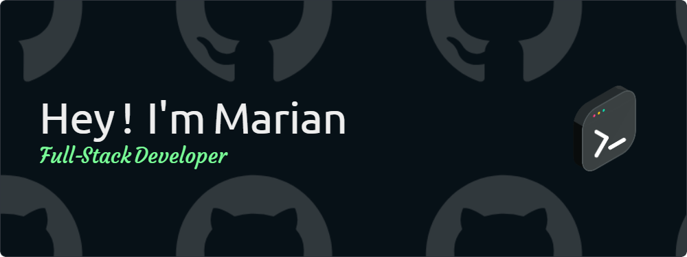

  

👨‍💻 I'm 23 years old and based in Montpellier

🌍 I'm Freelance specialized in beautiful websites crafting

🔧 My main skills include React, NodeJS and TailwindCSS. I am passionate about delivering high-quality UI/UX designs.

📫 Feel free to reach out to me via <a href="mailto:marian.bonhomme@gmail.com">email</a> or connect with me on <a href="https://www.linkedin.com/in/marian-bonhomme-developpeur-montpellier">LinkedIn</a>.

  

<h3 align="center">Favorite Technos:</h3>

  
  &nbsp
  
  &nbsp
  
  &nbsp
  
  &nbsp
  
  &nbsp
    
  &nbsp
  

  

  
  

  

  

<h3 align="center">Connect with me:</h3>

  
  &nbsp
  
  &nbsp
  

