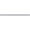

<h3 align="center">Favorite Technos:</h3>

  
  &nbsp
  
  &nbsp
  
  &nbsp
  
  &nbsp
  
  &nbsp
    
  &nbsp
  

  

  
  

  

<h3 align="center">Connect with me:</h3>

  
  &nbsp
  
  &nbsp
  

