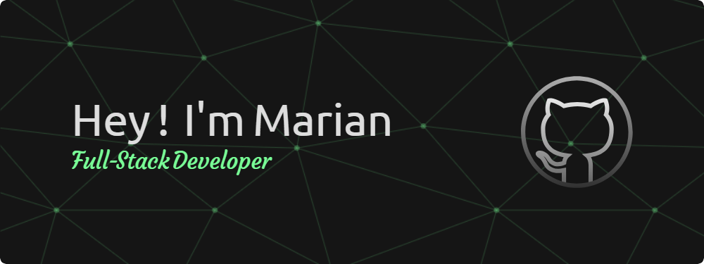

<h3 align="left">Favorite Stack:</h3>

  
  &nbsp
  
  &nbsp
  

<h3 align="left">Other Technos:</h3>

  
  &nbsp
  
  &nbsp
  

<h3 align="left">Connect with me:</h3>

  
  &nbsp
  
  &nbsp
  

  
  &nbsp
  

